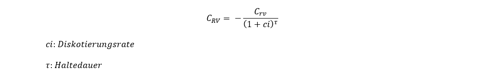
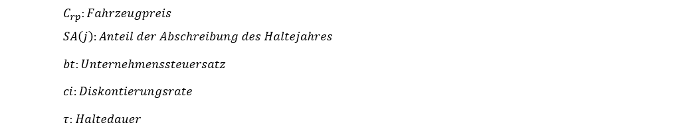
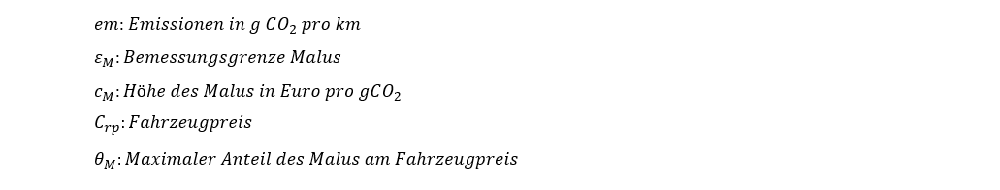
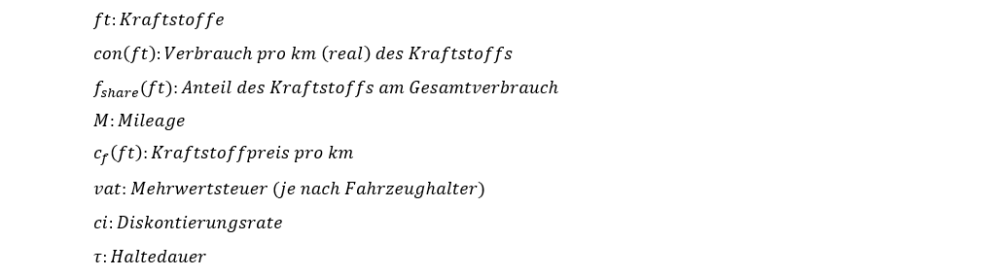
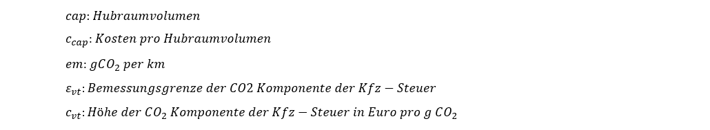

# TEMPS Dokumentation
(Stand Mai 2024)

## 1 Einleitung

Das am Öko-Institut entwickelte Modell TEMPS (Transport Emissions and Policy Scenarios) ermöglicht die Quantifizierung der Entwicklung von Endenergiebedarf und Treibhausgasemissionen des Verkehrs in Deutschland. Die Szenarien berücksichtigen unterschiedliche politische und techno-ökonomischen Rahmenbedingungen und können die Wirkung einzelner Politikinstrumente ermitteln. Darüber hinaus lassen sich mit TEMPS die Entwicklung der Neuzulassungsstruktur und des Fahrzeugbestandes von Straßenfahrzeugen sowie Verlagerungen der Verkehrsnachfrage bestimmen.

Im Zentrum des Modells steht die Markthochlaufmodellierung für Straßenfahrzeuge (Pkw, LNF und Lkw) anhand eines umfangreichen Neuzulassungs- und Bestandsmodells. Dieses simuliert die Kaufentscheidung für repräsentative Nutzungsprofile bottom-up unter Berücksichtigung verschiedener technischer, ökonomischer und regulatorischer Bedingungen. Für alle weiteren Verkehrsträger (Schienenverkehr, Schifffahrt, Luftfahrt, Busse, Motorräder, Fahrräder) werden Annahmen über Antriebe und ihre Effizienzentwicklung hinterlegt. 

Regulatorische Rahmenbedingungen und Entwicklungen des Marktes auf nationaler sowie europäischer Ebene werden in allen Szenarien berücksichtigt. Diese drücken sich beispielsweise durch Steuern, Mautgebühren oder Grenzwerte aus. Ebenso beeinflussen globale Trends die Wirtschaftlichkeit der Fahrzeuge, wie zum Beispiel die Entwicklung von Batterie- und Kraftstoffpreisen. Für die Nutzfahrzeuge spielen insbesondere die CO2-Flottenzielwerte, die Lkw-Maut sowie der Ausbau der Lade- und Tankstelleninfrastruktur für alternative Fahrzeugantriebe eine entscheidende Rolle.

___

## 2 Methodischer Ansatz

TEMPS ist ein Simulationsmodell, das bottom-up- und top-down-Ansätze miteinander kombiniert. Zunächst wird die Neuzulassungs- und Bestandsstruktur von Pkw und Lkw für rund 2400 Nutzungsprofilen bottom-up basierend auf einem TCO-Modell (Total Costs of Ownership) berechnet. Bei der Antriebswahl für Pkws werden darüber hinaus nicht-ökonomische Verhaltensweise über ein kalibriertes Logit-Modell berücksichtigt. Anschließend werden ermittelte Kennzahlen top-down anhand von u.a. der Verkehrsnachfrage und Energiebilanzdaten sowie weiteren Ist-Daten kalibriert. Die Kalibrierung und das kontinuierliche Nachführen der Ist-Daten stellt eine Kurzfristvalidierung der Modellierung sicher. Das Modell betrachtet die Verkehrsemissionen in Deutschland nach Sektordefinition des Klimaschutzgesetzes. Berücksichtigt wird die Verkehrsleistung nach dem Inlandsprinzip, der Fahrzeugbestand nach dem Inländerprinzip. Internationale Verkehre, welche von- oder nach Deutschland gehen, werden ebenfalls modelliert (Personenflugverkehr, Güterflugverkehr, Güterseeverkehr).

<figure markdown="span">
  <figcaption>Schematische Darstellung des Modells TEMPS</figcaption>
</figure>

Die Modellrechnung erfolgt jahresscharf. Es können Prognosen bis zum Jahr 2050 abgebildet werden. Bei Bedarf kann der Simulationszeitraum verlängert werden. Die Szenarioergebnisse werden auf nationaler Ebene ausgegeben. Modellintern werden teilweise räumlich differenzierte Daten verarbeitet, z.B. Personenverkehr unterteilt in die Kategorien urban, suburban und ländlich.

TEMPS besitzt Schnittstellen zu den Modellen PowerFlex und der Energiemodellierung ENUSEM des Öko-Instituts wodurch Wechselwirkungen mit dem Strommarkt abgebildet und Flexibilitätspotenziale der E-Mobilität berücksichtigt werden können. Darüber hinaus besteht eine Schnittstelle zu dem Verteilungswirkungsmodell DhoT (Dynamic Household Transport (microsimulation) Model) des Öko-Instituts sowie einer öknomischen Folgenabschätzung.

___

## 3 Nutzungsprofile und Fahrzeugkonfigurationen

Die Modellierung der Neuzulassungen von Pkw und Lkw basiert auf einem bottom-up-Ansatz, indem die Kaufentscheidung von insgesamt rund 2400 Nutzungsprofilen abgebildet wird. Die Gesamtheit der Nutzungsprofile bildet das Fahrverhalten der Bevölkerung im Motorisiertem Individualverkehr (MIV) bzw. der Logistikunternehmen im Güterverkehr repräsentativ ab.

Jedes Nutzungsprofil wird durch fünf Merkmale charakterisiert:
<ul>
  <li>Größenklasse des Fahrzeugs</li>
  <li>Art des Halters (privat, gewerblich, dienstwagennutzend, carsharing)</li>
  <li>Regionstyp des Halters (innenstadt, städtisch, ländlich)</li>
  <li>Jahresfahrleistung</li>
  <li>Haltedauer</li>
</ul>

Die Nutzungsprofile im MIV basieren auf dem „Mobilitätspanel“ (MOP) (Ecke et al. 2021) und der Studie „Mobilität in Deutschland 2017“ (Nobis und Kuhnimhof 2018). Für Lkw und LNF beruhen die Profile auf der Studie „Kraftfahrzeugverkehr in Deutschland 2010“ (Bundesministerium für Verkehr und digitale Infrastruktur (BMVI) 2010) und der Fahrleistungserhebung 2014 (Bäumer et al. 2017; Bundesanstalt für Straßenwesen (BASt) 2015).

Jedem Nutzungsprofil stehen – soweit auf dem Markt erhältlich – Fahrzeuge in den jeweiligen Größenklassen mit verschiedenen Antrieben und Effizienzen zur Verfügung. In Tabelle 1 sind die möglichen Antriebe für Pkw und Lkw dargestellt, die sich auf verschiedene Größenklassen verteilen (Tabelle 2).  
  

<table>
  <caption align="left">Tabelle 1: Mögliche Antriebsoptionen in TEMPS</caption>
  <thead>
    <tr>
      <th>Pkw</th>
      <th>Lkw</th>
    </tr>
  </thead>
  <tbody>
    <tr>
      <td>Diesel</td>
      <td>Batterieelektrische Oberleitungs-Lkw (O-BEV)</td>
    </tr>
    <tr>
      <td>Plug-In Hybrid (PHEV)</td>
      <td>Batterieelektrischer Antrieb (BEV)</td>
    </tr>
    <tr>
      <td>Batterieelektrischer Antrieb (BEV)</td>
      <td>Erdgasantrieb (LNG)</td>
    </tr>
    <tr>
      <td>Flüssiggasantrieb (LPG)</td>
      <td>Brennstoffzellenantrieb (FCEV)</td>
    </tr>
    <tr>
      <td>Erdgasantrieb (CNG)</td>
      <td></td>
    </tr>
    <tr>
      <td>Brennstoffzellenantrieb (FCEV)</td>
      <td></td>
    </tr>
  </tbody>
</table>

<table>
  <caption align="left">Tabelle 2: Größenklassen für Pkw und Lkw</caption>
  <thead>
    <tr>
      <th>Pkw</th>
      <th>Lkw</th>
    </tr>
  </thead>
  <tbody>
    <tr>
      <td>Klein</td>
      <td>Lkw von 3,5 bis 7,49 t</td>
    </tr>
    <tr>
      <td>Mittel</td>
      <td>Lkw von 7,5 bis 11,99 t</td>
    </tr>
    <tr>
      <td>Groß</td>
      <td>Lkw ab 12 t</td>
    </tr>
    <tr>
      <td>Leichte Nutzfahrzeuge (LNF)</td>
      <td>Last- und Sattelzüge</td>
    </tr>
  </tbody>
</table>

Für jedes Fahrzeugmodell (definiert über Größenklasse und Antrieb) stehen jährlich verschiedene Kombinationen aus Antriebseffizienz und entsprechendem Anschaffungspreis zur Auswahl. Die Herleitung dieser Kombinationen basiert auf Kostenkurven.  Zudem werden laufend aktualisierte Prognosen für Batteriekosten berücksichtigt.

___
## 4 Neuzulassungsmodell

### 4.1 TCO (Total Costs of Ownership)
Die Bestimmung der Kaufentscheidung eines Nutzungsprofils erfolgt in mehreren Schritten. Anhand einer TCO-Rechnung (Total Cost of Ownership) werden für jedes Nutzungsprofil die Vollkosten aller verfügbaren Fahrzeugmodelle berechnet. Die berücksichtigten Kostenkomponenten sind in Tabelle 3 gezeigt und werden im Folgenden näher beschrieben. 

<table>
  <caption align="left">Tabelle 3: Kostenbestandteile der TCO</caption>
  <thead>
    <tr>
      <th>Investitionskosten</th>
      <th>Laufende Kosten</th>
    </tr>
  </thead>
  <tbody>
    <tr>
      <td>Anschaffungspreis</td>
      <td>Kraftstoffkosten (inkl. Energiesteuern)</td>
    </tr>
    <tr>
      <td>Kaufförderung*</td>
      <td>Fixkosten (Kfz-Steuer und Versicherung)</td>
    </tr>
    <tr>
      <td>Steuerersparnis* durch Abschreibung für gewerbliche Nutzungsprofile</td>
      <td>Maut (optional)</td>
    </tr>
    <tr>
      <td>Restwert*</td>
      <td>THG-Prämie*</td>
    </tr>
    <tr>
      <td>Malus (optional)</td>
      <td>Sonstige variable Kosten (Wartung, Reparatur etc.)</td>
    </tr>
  </tbody>
</table>
**Gutschrift*

Die Literatur zeigt, dass private Fahrzeugkäufer meist nicht die langfristigen Kosten der Fahrzeughaltung und -nutzung berücksichtigen, es findet also eine gedankliche Abzinsung statt (Mock 2010). Es wird angenommen, dass die privaten Pkw-Käufer für ihre Kaufentscheidung nur die ersten drei Jahre zu Grunde legen und für zukünftige Zahlungen eine Diskontrate von 5 % anwenden.
Bei Lkw hingegen spielt die gesamte Haltedauer eine entscheidende Rolle für die Wirtschaftlichkeit eines Fahrzeugs und wird als Grundlage der Kaufentscheidung herangezogen. Aufgrund ihrer hohen Fahrleistung liegen die Haltedauern bei Lkw deutlich niedriger als bei Pkw. Diese liegen nach einer standardisierten Online-Befragung von Transportunternehmen im Frühjahr 2021 (Göckeler et al. 2022) zwischen 3-9 Jahren. Zusätzlich wird bei allen gewerblichen Haltern die Abschreibung berücksichtigt, welche mindernd auf die Unternehmenssteuern wirkt. Dabei werden ein Unternehmenssteuersatz von 30 % und eine Abschreibungsdauer von 9 Jahren zu Grunde gelegt.

#### 4.1.1 Anschaffungspreis 
Der Anschaffungspreis ergibt sich direkt aus den Kostenkurven der Fahrzeuge und berücksichtigt aktuelle Batteriepreisprognosen. Er fällt zum Kaufzeitpunkt an und geht daher nicht diskontiert in die TCO ein.

#### 4.1.2 Restwerte
Der Restwert eines Fahrzeugs geht zum Ende der Haltedauer als Erlös in die TCO ein. Basierend auf Daten zur Restwertentwicklung von Fahrzeugen mit Verbrennungsmotoren wurde eine Regressionskurve abgeleitet, die den Restwert eines Fahrzeugs unter Berücksichtigung des Kaufpreises, der Laufleistung und des Fahrzeugalters bestimmt. Für das Modell wurde eine Regressionskurve des Statistischen Bundesamtes verwendet (Dexheimer 2003).
Die Gleichung lautet:

mit

Der Restwert wird anschließend über die Haltedauer diskontiert:

#### 4.1.3 Absetzung für Abnutzung (AFA) und Restbuchwert
Bei gewerblichen Haltern wird die Abschreibung berücksichtigt, welche mindernd auf die Unternehmenssteuern wirkt. Es wird dabei ein Unternehmenssteuersatz von 30 % zu Grunde gelegt, sowie eine Abschreibungsdauer von 6 Jahren für Pkw und leichte Nutzfahrzeuge und 9 Jahren für schwere Nutzfahrzeuge.

Diese erlaubt es 50 % der Investition zusätzlich zur normalen jährlichen Abschreibung bereits im Jahr der Anschaffung steuerlich abzusetzen. Durch die Sonder‐AfA bietet sich dem Steuerpflichtigen die Möglichkeit, im ersten Jahr höhere Verluste steuerlich geltend zu machen und somit seinen zu versteuernden Gewinn zu reduzieren. Ab dem zweiten Jahr kehrt sich dieser Effekt um, da nunmehr ein geringeres Abschreibungsvolumen zur Verfügung steht. Der monetäre Vorteil einer Sonder‐AfA für den Fahrzeughalter beruht somit auf dem Zins‐ und Liquiditätsvorteil, der sich durch eine vorgezogene Abschreibung ergibt.
Die AFA berechnet sich aus:

mit

Bei einem Wiederverkauf des Fahrzeugs vor dem Zeitpunkt der vollständigen Abschreibung (im Regelfall nach 6 Jahren) muss die Differenz zwischen Verkaufserlös und Restbuchwert versteuert werden. Da bei einer Sonder‐AfA der Restbuchwert schneller sinkt, muss beim Wiederverkauf ein höherer Erlös versteuert werden. Der Restbuchwert berechnet sich aus:

mit

#### 4.1.4 Kaufprämie
Die Kaufprämie geht direkt als Gutschrift im Anschaffungsjahr in die TCO ein. Es wird davon ausgegangen, dass der Herstelleranteil durch eine Anhebung der Kaufpreise gegenfinanziert wird und damit keine Vergünstigung für den Käufer bewirkt. 

#### 4.1.5 Malus
Beim Malus wird die Kfz-Steuer für Pkw so geändert, dass im ersten Jahr nach der Neuzulassung eine höhere Kfz-Steuer in Abhängigkeit der CO2-Emissionen pro km eines Fahrzeuges anfällt. Die Höhe des Malus wird immer ausgehend von einer Bemessungsgrenze ermittelt. Unterhalb der Bemessungsgrenze wird kein Malus fällig. Für jedes Gramm CO2 oberhalb der Bemessungsgrenze wird eine einmalige Maluszahlung fällig.
Weil zu erwarten ist, dass Zusatzkosten ab einer gewissen Höhe keinen relevanten Beitrag mehr leisten, kann die absolute Höhe der Zusätzlichen CO2-Komponente der Kfz-Steuer auf 50% des Listenpreises des Fahrzeugs gedeckelt werden. Eine solche Deckelung besteht u.a. auch in Frankreich. 
Der Malus berechnet sich aus:

mit

#### 4.1.6 Kraftstoffkosten
Die Kraftstoffkosten berechnen sich aus den Kraftstoffpreisen, dem Kraftstoffmix je Antrieb, dem Verbrauch pro km und der Jahresfahrleistung. Private Halter zahlen außerdem noch die Mehrwertsteuer auf den Kraftstoffpreis. 

mit

#### 4.1.7 THG-Quote und THG-Prämie
In der THG-Quote sind Mindestquoten für verschiedene erneuerbare Kraftstoffe definiert (teilweise auch Maximalquoten). Die Erfüllung der THG-Quote führt modellseitig zu steigenden Kosten für konventionelle Kraftstoffe und damit zu einer steigenden TCO für konventionelle Fahrzeuge, da erneuerbare Kraftstoffe höhere Produktionskosten aufweisen. Gleichzeitig sinkt die TCO für batterieelektrische Fahrzeuge, da davon ausgegangen wird, dass die Halter die Quotenberechtigung der BEV an die Inverkehrbringer der konventionellen Kraftstoffe verkaufen können (THG-Prämie).

#### 4.1.8 Variable Kosten
Die jährlichen variablen Kosten setzen sich zusammen aus Schmierstoff-, Pflege-, Reifen-, Reparatur- und Inspektionskosten. Für die variablen Kosten werden durchschnittliche Werte hinterlegt.

#### 4.1.9 Jährliche Fix-Kosten
Die jährlichen Fixkosten setzen sich aus der Kfz-Steuer und Versicherungskosten zusammen. Während für die Versicherungskosten durchschnittliche empirische Werte hinterlegt sind, wird die Kfz-Steuer modellseitig individuell für jedes Fahrzeug entsprechend der zum Zeitpunkt geltenden Steuersätze berechnet.
Die derzeit gültige Kfz-Steuer setzt sich aus einer vom Hubraum abhängigen Komponente und einer CO2-abhängigen Komponente zusammen. Bei der CO2-abhängigen Komponente werden je Gramm CO2-Ausstoß oberhalb eines Freibetrages in Gramm CO2 pro Kilometer unterschiedliche Beträge fällig. Für batterieelektrische Fahrzeuge ist eine Befreiung von der Kfz-Steuer für 10 Jahre hinterlegt, anschließend werden sie gewichtsabhängig besteuert. 
Die Kfz-Steuer berechnet sich aus:

mit

#### 4.1.10 Maut
Für Lkw werden fahrleistungsabhängige Mautkosten berücksichtigt. Die Maut berücksichtigt aktuell die folgenden Kostenkomponenten, mit den derzeit gültigen Mautsätzen:
<ul>
  <li>Infrastruktur</li>
  <li>Luftschadstoffe</li>
  <li>Lärm</li>
  <li>CO2</li>
</ul>

Elektrische Lkw sind derzeit von der Maut befreit. Um die Deckung der Wegekosten gemäß der Wegekostenrichtlinie dennoch sicherzustellen, wird die Infrastrukturkomponente regelmäßig angepasst. Es ist möglich die Maut auch auf Pkw auszuweiten. Zudem können weitere Kosten internalisiert werden, wie Unfallkosten, Abnutzung sowie Natur und Landschaft.

#### 4.1.11 Dienstwagensteuer
Die Bereitstellung eines Dienstwagens zur privaten Nutzung stellt steuerrechtlich einen Geldwerten Vorteil dar. Dieser kann über die genaue Abrechnung aller privaten Fahrten mit der Fahrtenbuchmethode erfolgen oder aber, in Deutschland sehr verbreitet, über einen Pauschalierungsansatz.  Hierzu wird der Geldwerte Vorteil pauschal über den Bruttolistenpreis des Dienstwagens und die einfache Distanz zur Arbeitsstätte des Arbeitnehmenden abgeschätzt. Im Status Quo wird für die Pauschalierung 1% des Bruttolistenpreises plus 0,03% je Kilometer Arbeitsweg für die Berechnung des monatlich zu versteuernden geldwerten Vorteils genutzt. Für die Berechnung wird auf einen durchschnittlichen Arbeitsweg von 18 Kilometern einfacher Strecke, der anhand der MiD 2017 berechnet wurde, zurückgegriffen. Ferner wird ein Grenzsteuersatz von 40% für die Kalkulation der zusätzlichen finanziellen Belastung aus der Besteuerung des Grenzwerten Vorteils angenommen. Für elektrische Dienstwagen und PHEV gelten im Status Quo besondere Regelungen, sodass diese teilweise nur 0,25% bzw. 0,5% anstelle der 1% versteuern müssen. 

Diese zusätzliche finanzielle Belastung durch die Besteuerung des geldwerten Vorteils der Dienstwagennutzung wird im Rahmen der TCO-Rechnung berücksichtigt und hat somit Einfluss auf die Pkw-Wahl.

Zusätzlich wird im Rahmen der TCO-Rechnung ebenfalls berücksichtigt, dass der Arbeitgeber vorsteuerabzugberechtigt ist und daher die Mehrwertsteuer bei Kauf entfällt bzw. zurückgefordert werden kann und daher kein Einfluss auf die TCO hat. 

### 4.2 Logit-Modell für Pkw

Nachdem mit der TCO-Rechnung für jedes Pkw-Nutzungsprofil und jeden Antrieb die jeweils kostengünstigste Effizienz ermittelt wird, wird die Verteilung der Antriebe über ein Logit-Modell bestimmt. Das Logit-Modell ermöglicht es, antriebspezifische Attraktivitätsmerkmale, die über die rein ökonomische Betrachtung hinausgehen, zu berücksichtigen.
Die Realität zeigt, dass Menschen sich bei der Kaufentscheidung nicht grundsätzlich für das günstigste Fahrzeug entscheiden, sondern stattdessen andere Faktoren wie Komfort, Gewohnheit, Popularität oder Status bei der Kaufentscheidung von großer Bedeutung sind. Das Logit-Modell bildet somit diese antriebsspezifischen Charakteristika ab.
Die Wahrscheinlichkeit für den Kauf eines Pkw mit dem Antrieb i kann mit dem Logit-Modell mittels der Gleichung

beschrieben werden. Dabei bezeichnet *Xi* einen Pkw mit Antrieb *i*. *val(Xi)* ist eine Wertfunktion, die der TCO des Fahrzeugs *Xi* entspricht und sich je nach Käufer unterscheidet. Die Wertfunktion hängt u. a. von den Logit-Parametern, der Haltergruppe (gewerblich / privat) und dem geplanten Fahrleistungsprofil des Käufers ab. 
Die Logit-Parameter des Modells werden an den Neuzulassungszahlen des letzten historischen Jahres kalibriert. Es wird davon ausgegangen, dass die Attraktivität von alternativen Antrieben sich bis 2035 sukzessive dem Niveau von Benzinern annähert. Dies liegt an den verschärften CO2-Flottenzielwerten, die bis zum Jahr 2035 auf null sinken.
Eine Kalibrierung anhand der EU-Monitoringdaten stellt zudem sicher, dass die Auswahl der Fahrzeugeffizienzen mit den Ist-Daten übereinstimmt und auch in der Prognose zuverlässig ist. 

### 4.3 Neuzulassungsstruktur für Nutzfahrzeuge

Die Kaufentscheidung nach Antrieben bei den Nutzfahrzeugen erfolgt – anders als bei den Pkw – allein anhand ökonomischer Kriterien. Dies beruht auf der Annahme, dass bei Logistikunternehmen insbesondere die Wirtschaftlichkeit der Fahrzeuge im Fokus steht. 
Die Antriebswahl erfolgt über einen direkten Vergleich der TCO aller Antriebsoptionen und Antriebseffizienzen. Wenn die Gesamtnutzungskosten für verschiedene Kaufoptionen sehr ähnlich sind, erfolgt die Auswahl des Antriebs mithilfe einer stochastischen Normalverteilungsfunktion. Damit soll sichergestellt werden, dass ein geringfügiger wirtschaftlicher Vorteil eines Antriebs keine übermäßige Auswirkung auf die Verteilung der Neuzulassungen hat.

Die Formel ermittelt jeweils die Auswahlwahrscheinlichkeit *P* für jede Antriebsoption *i* in Abhängigkeit der jeweiligen TCO *y*. Der Mittelwert *μ* der Verteilungskurve entspricht der TCO der insgesamt günstigsten Antriebsoption.

### 4.4 Energieinfrastruktur

Bei batterieelektrischen Antrieben spielt das Fahrverhalten eine entscheidende Rolle bei der Antriebswahl. Nutzungsprofile, die viele weite Strecken zurücklegen, werden sich - soweit noch keine hinreichende Ladeinfrastruktur besteht - in ihrem Kaufverhalten gegen einen batterieelektrischen Antrieb entscheiden. 

In TEMPS wird die Einsatzrestriktion batterieelektrischer Antriebe von Pkw in Relation zur Anzahl der Fahrten parametrisiert, welche die Batteriereichweite überschreiten. Es wird angenommen, dass eine Kaufentscheidung für ein batterieelektrisches Fahrzeug auch dann getroffen wird, wenn eine bestimmte Anzahl an Fahrten mit dem Fahrzeug aufgrund der limitierten Ladeinfrastruktur derzeit noch nicht zurückgelegt werden kann. Die absolute Anzahl dieser Fahrten wird für 30 verschiedene Gruppen aus den Wegedatensätzen der MiD (Nobis und Kuhnimhof 2018) abgeleitet. Dies geschieht differenziert nach Haltergruppe, Größenklasse und Jahresfahrleistung. Für jedes Nutzungsprofil wird die Anzahl der Fahrten anschließend über eine Poisson-Verteilung über den berechneten Mittelwert der jeweiligen Gruppe ermittelt. Die resultierende Limitierung der batterieelektrischen Fahrzeuge reduziert sich aufgrund des Ausbaus der öffentlichen Ladeinfrastruktur kontinuierlich, bis im Jahr 2035 keine Restriktion mehr besteht.

Batterieelektrische Lkw stehen in TEMPS zunächst nur als Kaufoption für Nutzungsprofile zur Verfügung, wenn ihre durchschnittliche Tagesfahrleistung (abgeleitet aus der KiD (Bundesministerium für Verkehr und digitale Infrastruktur (BMVI) 2010)) vollständig über ihre Batteriereichweite abgedeckt ist. Im Zeitverlauf wird jedoch ein Ausbau der Infrastruktur angenommen, sodass die Reichweite durch Ladestopps erhöht werden kann. Insgesamt ergeben sich drei Ausbaustufen. In der ersten Ausbaustufe können Lkw nur einmal täglich im Depot geladen werden. In der zweiten Ausbaustufe kann nach jeder Tour, beispielsweise am Logistikzentrum oder bei Kund*innen, nachgeladen werden. In der dritten Stufe kann jederzeit während der Fahrt an öffentlichen Megawatt-Ladepunkten entlang der Autobahn zwischengeladen werden und die Restriktion durch die Batteriereichweite entfällt. Eine detaillierte Beschreibung der Methodik zur Ladeinfrastruktur ist der Studie StratES (Göckeler et al. 2023) zu entnehmen. 

Für Brennstoffzellen-Lkw werden modellseitig keine Restriktionen des Fahrzeugeinsatzes berücksichtigt. Es wird davon ausgegangen, dass technische Entwicklungen dazu führen, dass im Jahr 2030 bis zu 1000 km Reichweite erreicht werden. 

### 4.5 Bestandsmodellierung

Die Motorisierungsrate gibt das Verhältnis von Pkw zu Einwohner*innen an und bildet die Grundlage für die Bestandsmodellierung der Pkw. Im Modell wird bis 2030 die historische Entwicklung der Motorisierungsrate fortgeschrieben und angenommen, dass sie ab diesem Zeitpunkt konstant bleibt. Der nationale Pkw-Bestand fließt als Inputgröße in das Modell und wird anhand von Bevölkerungsprognosen jahresscharf fortgeschrieben.

Die Lebensdauern der Pkw im deutschen Bestand wird über Überlebenskurven abgebildet, die aus dem Modell TREMOD von IFEU übernommen werden. Diese Überlebenskurven sind abhängig von Größenklasse und Antrieb. 

Die Bestandsmodellierung von Pkw erfolgt in vier Schritten: Zunächst wird für jedes Jahr berechnet, welche Fahrzeuge den Überlebenskurven nach aus dem Bestand ausscheiden. Dann wird der Anteil an Fahrzeugen bestimmt, die nach einer Haltedauer von 3 Jahren von kommerziellen Haltern in den privaten Bestand übergehen. Anschließend wird die Differenz aus der Flotte und dem Zielwert aus dem Input berechnet. Diese Differenz wird dann zu aus der Empirie abgeleiteten Anteilen von kommerziellen und privaten Haltern durch neuzugelassene Fahrzeuge ersetzt.

Die Bestandsmodellierung von Lkw erfolgt analog zur Bestandsmodellierung der Pkw. Da bei den Lkw ein relevanter Teil der Fahrleistung von ausländischen Lkw erbracht wird, stellt dies eine Vereinfachung dar. Die Größe des Lkw-Bestandes ist Inputgröße und abhängig von der Güterverkehrsnachfrage. 
___

### 4.6 Verkehrsnachfrage

Die Verkehrsnachfrage ist Inputgröße für die Markthochlaufmodellierung. Sie setzt sich zusammen aus historischen Daten und darauf aufsetzenden spezifischen Steigerungsraten. Die historischen Daten beruhen sowohl bei der Personen- als auch der Güterverkehrsnachfrage auf Daten aus Verkehr in Zahlen [(BMVI 2019)](#BMVI_2019) Destatis sowie Ergebnissen des Verkehrsnachfragemodells TREMOD des IFEU. Für zukünftige Entwicklungen wird (Stand 2024) auf die Steigerungsraten aus dem Referenzszenario der Mobilitäts- und Kraftstoffstrategie (MKS) REF-2020 [(Schade et al. 2023)](#Schade_2023) zurückgegriffen. Dabei berücksichtigt die Personenverkehrsnachfrage zusätzlich die Bevölkerungsentwicklung. Die Trendfortschreibung des Gütertransportaufkommens orientiert sich stark an der Entwicklung des Bruttoinlandsprodukts (BIP) und den damit zusammenhängenden Handelsströmen und Transporten.

Die internationalen Verkehre (Schiff- und Luftverkehr) sowie der nationale Luftverkehr bilden jedoch eine Ausnahme. Die historischen Jahre beim nationalen und internationalen Luftverkehr werden anhand von DESTATIS-Daten nachgeführt und für die Prognose zukünftiger Entwicklungen Wachstumsprognosen der ICAO [(ICAO 2016)](#ICAO_2016) angewendet.

#### 4.6.1 Verkehrsverlagerung im Personenverkehr
Vermeidung und Verlagerung zu anderen Verkehrsträgern werden im Modell TEMPS durch direkte Preiselastizitäten abgebildet. Die direkte Elastizität beschreibt, wie sich Preisänderungen auf die Verkehrsnachfrage eines bestimmten Verkehrsmittels auswirken.

Dabei gibt beispielsweise eine direkte Preiselastizität von -0,3 an, dass eine Preiserhöhung um 10% die Verkehrsleistung um 3% reduzieren würde. Wenn sich die Verkehrsleistung eines Verkehrsmittels reduziert, kann das sowohl an Verkehrsvermeidung als auch an einer Verlagerung auf andere Verkehrsträger liegen.

Die Preiselastizitäten für den Personenverkehr sind in [(Hautzinger et al. 2004)](#Hautzinger_2004) empirisch herge-leitet. Für den motorisierten Individualverkehr ist darin eine Preiselastizität von -0,3 auf Kraft-stoffpreisänderungen sowie eine Kreuzpreiselastizität für den öffentlichen Verkehr von 0,13 angegeben. Auch die Studie [(Reaños und Sommerfeld 2018)](#Reaños_2021) ermittelt für den Individualverkehr eine Elastizität von durchschnittlich -0,3. Langfristige Preisreaktionen wie die Anpassung der Antriebswahl werden in TEMPS über die TCO-Rechnung abgedeckt. 

Elastizitäten können immer in beide Richtungen wirken: Eine zunehmende Elektrifizierung des MIV und dem damit einhergehenden Wirkungsverlust von CO2-abhängigen Preisinstrumenten etwa können langfristig zu einer Zunahme der Verkehrsleistung im MIV führen.

Beim Personenverkehr werden in TEMPS zusätzlich Kapazitätsengpässe auf der Schiene berücksichtigt. Wenn die aus [(NPM 2021)](#NPM_2021) abgeleitete maximale Kapazität erreicht ist,  werden zusätzliche 15% der sonst auf die Schiene verlagerten Verkehrsleistung vermieden. Weitere 30% werden bevorzugt auf andere Verkehrsträger wie Fernbusse, Linienbusse und Reisebusse verlagert. Dies erfolgt aufgrund der Annahme, dass Busbetreiber flexibler auf eine erhöhte Nachfrage reagieren können. Die übrigen 55% werden weiterhin mit dem ursprünglichen Verkehrsträger zurückgelegt. 

#### 4.6.2 Verkehrsverlagerungen im Güterverkehr
Im Güterverkehr werden Verlagerungen vom Straßenverkehr auf die Schiene und auf die Binnenschifffahrt betrachtet. Dabei wird angenommen, dass die Änderung der Verkehrsleistung äquivalent zur Änderung der Nutzerkosten erfolgt. Bei den Nutzerkosten werden neben den Kraftstoffkosten auch anfallende Mautgebühren mit einbezogen. Im Güterverkehr sind Elastizitäten aus [(Jong et al. 2010)](#Jong_2010) entnommen. Für Änderungen der Transportkosten im Straßen-güterverkehr wird dort anhand einer Literaturrecherche ein konsistentes Set an Elastizitäten angegeben und mit -0,6 in Bezug auf die Verkehrsleistung im Straßengüterverkehr bestimmt. Die Kreuzpreiselastizität für andere Verkehrsträgeroptionen wird dabei auf 0,3 abgeschätzt. Anders als beim Personenverkehr findet im Güterverkehr eine Verlagerung zu 100% statt, das heißt es gibt keine Verkehrsvermeidung durch Kosteneffekte. Von der preisinduzierten Verkehrsverlagerung werden 80% auf die Bahn und 20% auf die Binnenschifffahrt verlagert. Zusätzlich wird bei beiden Verkehrsträgern ein Umwegfaktor von 16% angenommen. Durch die zunehmende Elektrifizierung im Straßengüterverkehr kommt es perspektivisch zur Reduktion der Transportkosten. Dies kann eine Zunahme der Fahrleistung durch Verlagerung mit sich ziehen (Rebound), sofern nicht andere Kosten ansteigen (z.B. Maut). 
___
### 4.7 Endenergieverbrauch und Treibhausgasemissionen
Die Zusammensetzung der Flotte (Lkw und Pkw) nach Fahrzeugtyp wird über die Bestandsmodellierung bestimmt. Dabei wird zunächst die Jahresfahrleistung aus den Nutzungsprofilen übernommen. Hier haben die Nutzungskosten wie beispielsweise Kraftstoffpreise oder Mautgebühren einen direkten Einfluss auf die Verteilung der Fahrleistung nach Antrieben oder Effizienzen. Im Anschluss an die Bestandsmodellierung wird die gesamte Verkehrsnachfrage kalibriert, wobei die Verteilung nach Größenklasse, Region, Halter, Antrieb und Effizienz erhalten bleibt. Anschließend werden Verlagerungseffekte zu anderen Verkehrsträgern (siehe [Kapitel 4.6](#4.6)) berücksichtigt.

Die Berechnung des Endenergieverbrauchs erfolgt direkt entlang des spezifischen Verbrauchs der Fahrzeuge der Bestandsflotte. Ladeverluste von Batteriefahrzeugen werden berücksichtigt. Für die Berechnung der Emissionen werden Emissionsfaktoren genutzt. Neben CO2-Emissionen werden Lachgas und Methanemissionen berechnet. Zudem werden für den Straßenverkehr auch Luftschadstoffemissionen ermittelt.

___
## 5 Literaturverzeichnis

Agora Verkehrswende (Hg.) (2018): Umparken – den öffentlichen Raum gerechter verteilen. Zahlen und Fakten zum parkraummanagement. 2. Aufl. Unter Mitarbeit von Anne Klein-Hitpaß, Wolfgang Aichinger, Uta Bauer, Martina Hertel, Rosa Rausch, Robert Sedlak und Julia Kirsch-Bauer. tippingpoints GmbH; Deutsches Institut für Urbanistik (Difu). Berlin.

Bäumer, Marcus; Hautzinger, Heinz; Pfeiffer, Manfred; Stock, Wilfried; Lenz, Barbara; Kuhnimhof, Tobias Georg; Köhler, Katja (2017): Fahrleistungserhebung 2014 - Inlandsfahrleistung und Unfallrisiko. Bremen (Berichte der Bundesanstalt für Straßenwesen Verkehrstechnik). Online verfügbar unter https://bast.opus.hbz-nrw.de/opus45-bast/frontdoor/deliver/index/docId/1775/file/BASt_V_291_barierefreies_Internet_PDF.pdf, zuletzt geprüft am 08.07.2021.

BMVI (2019): Verkehr in Zahlen 2019/2020. 48. Jahrgang. Unter Mitarbeit von Deutsches Institut für Wirtschaftsforschung Berlin (DIW Berlin) und Kraftfahrt-Bundesamt (KBA). Hg. v. Bundesministerium für Verkehr und digitale Infrastruktur (BMVI).

Bundesanstalt für Straßenwesen (BASt) (Hg.) (2015): Ergebnisse Fahrleistungserhebung 2014. BASt. Online verfügbar unter http://www.bast.de/DE/Verkehrssicherheit/Fachthemen/u2-fahrleistung-2014/u2-Fahrleistung-2014-ergebnisse.html?nn=605482, zuletzt geprüft am 05.07.2017.

Bundesministerium für Verkehr und digitale Infrastruktur (BMVI) (Hg.) (2010): Kraftfahrzeugverkehr in Deutschland 2010 (KiD 2010). Ergebnisse der bundesweiten Verkehrsbefragung. BMVI. Online verfügbar unter http://www.bmvi.de/SharedDocs/DE/Artikel/G/kraftfahrzeugverkehr-in-deutschland-2010-kid-2010.html, zuletzt geprüft am 28.02.2018.

Dexheimer, Verena (2003): Hedonic Methods of Price Measurement for Used Cars. German Federal Statistical Office (Destatis).

Ecke, Lisa; Chlond, Bastian; Magdolen, Miriam; Vallée, Jan; Vortisch, Peter (2021): Deutsches Mobilitätspanel (MOP) – Wissenschaftliche Begleitung und Auswertungen Bericht 2020/2021: Alltagsmobilität und Fahrleistung. Hg. v. Karlsruher Institut für Technologie (KIT). Karlsruhe. Online verfügbar unter https://mobilitaetspanel.ifv.kit.edu/downloads/Bericht_MOP_20_21.pdf.

Göckeler, K.; Hacker, F.; Ziegler, L.; Heinzelmann, J.; Lesemann, L.; Bernecker, T. (2022): Anforderungen der Logistikbranche an einen Umstieg auf klimaschonende Fahrzeugtechnologien - Ergebnisbericht einer standardisierten Befragung. Zweiter Teilbericht des Forschungs- und Dialogvorhabens „StratES: Strategie für die Elektrifizierung des Straßengüterverkehr“. Öko-Institut; Hochschule Heilbronn. Online verfügbar unter https://www.oeko.de/fileadmin/oekodoc/StratES-Teilbericht_2-Befragung_Logistikbranche.pdf, zuletzt geprüft am 06.07.2022.

Göckeler, Katharina; Steinbach, Inia; Görz, Wolf; Hacker, Florian; Blanck, Ruth; Mottschall, Moritz (2023): StratES – Szenarien für die Elektrifizierung des Straßengüterverkehrs. Studie auf Basis von Markthochlaufmodellierungen. Dritter Teilbericht des Forschungs- und Dialogvorhabens StratES. Hg. v. Öko-Institut. Öko-Institut. Online verfügbar unter https://www.oeko.de/fileadmin/oekodoc/StratES-Szenarien-Elektrifizierung-Strassengueterverkehr.pdf, zuletzt geprüft am 27.09.2023.

Hautzinger, H.; Mayer, K.; Helms, M.; Kern, C.; Wiesenhütter, M.; Haag, G.; Binder, J. (2004): Analyse von Änderungen des Mobilitätsverhaltens - insbesondere der Pkw-Fahrleistung - als ktion auf geänderte Kraftstoffpreise. Schlussbericht zum FP 96.0756/2002 des BMVBW. Hg. v. Institut für angewandte Verkehrs- und Tourismusforschung (IVT). Online verfügbar unter https://www.forschungsinformationssystem.de/servlet/is/164566/, zuletzt geprüft am 14.08.2023.

ICAO (2016): ICAO Long-Term Traffic Forecasts, Passenger and Cargo. International Civil Aviation Organization (ICAO). Montreal. Online verfügbar unter https://www.icao.int/safety/ngap/NGAP8%20Presentations/ICAO-Long-Term-Traffic-Forecasts-July-2016.pdf, zuletzt aktualisiert am 2016, zuletzt geprüft am 08.05.2020.

Jong, Gerard de; Schroten, Arno; van Essen, Huib; Otten, Matthijs; Bucci, Pietro (2010): Price sensitivity of European road freight transport – towards a better understanding of existing results. significance; CE Delft, zuletzt geprüft am 04.10.2016.

Mock, Peter (2010): Entwicklung eines Szenariomodells zur Simulation der zukünftigen Marktanteile und CO2-Emissionen von Kraftfahrzeugen (VECTOR21). Dissertation. Universität Stuttgart, zuletzt geprüft am 05.10.2016.

Nobis, Claudia; Kuhnimhof, Tobias (2018): Mobilität in Deutschland – MiD. Ergebnisbericht. FE-Nr. 70.904/15. Hg. v. Bundesministerium für Verkehr und digitale Infrastruktur (BMVI). infas; DLR; IVT; infas 360. Bonn, Berlin. Online verfügbar unter http://www.mobilitaet-in-deutschland.de/pdf/MiD2017_Ergebnisbericht.pdf, zuletzt geprüft am 25.11.2021.

NPM (2021): Wege für mehr Klimaschutz im Verkehr. Arbeitsgruppe 1 Klimaschutz im Verkehr. Online verfügbar unter https://www.plattform-zukunft-mobilitaet.de/wp-content/uploads/2021/07/NPM_AG1_Wege-fuer-mehr-Klimaschutz.pdf, zuletzt geprüft am 20.05.2022.

Reaños, Miguel A. Tovar; Sommerfeld, Katrin (2018): Fuel for inequality. Distributional effects of environmental reforms on private transport. In: Resource and Energy Economics 51, S. 28–43. DOI: 10.1016/j.reseneeco.2017.10.007.

Schade, Wolfgang; Perez, E.; Berthold D.; Wagner, U.; Krail, M.; Waßmuth, V. (2018): Gestaltung des neuen Referenzszenarios zur Nutzung in der MKS 2017+. Arbeitspapier im Auftrag des Bundesministeriums für Verkehr und digitale Infrastruktur, Karlsruhe

Schade W., Anstett P., Berthold D., Emmerich C., Emmerich J., Haug I., Khanna A., Krail M., Oehme R., Streif M., Walther C., Waßmuth V. (2023): Gestaltung des MKS-Referenzszenarios für die Periode 2022 bis 2050 (REF-2050). Arbeitspapier im Auftrag des Bundesministeriums für Digitales und Verkehr (BMDV), Karlsruhe.
