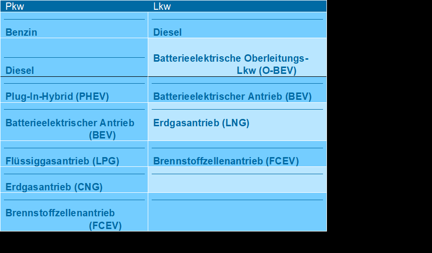

# TEMPS Dokumentation

For full documentation visit [TEMPS_documentation.org](https://oekoinstitut.github.io/TEMPS_documentation/).

## Einleitung

Das am Öko-Institut entwickelte Modell TEMPS (Transport Emissions and Policy Scenarios) ermöglicht die Quantifizierung von Endenergiebedarf und Treibhausgasemissionen des Verkehrs in Deutschland. Die Szenarien können sich in ihren politischen und techno-ökonomischen Rahmenbedingungen unterscheiden. Darüber hinaus lassen sich mit TEMPS Neuzulassungsstruktur und Fahrzeugbestand von Straßenfahrzeugen sowie Verlagerungen in der Verkehrsnachfrage bestimmen.
Im Zentrum des Modells steht die Markthochlaufmodellierung für Straßenfahrzeuge (Pkw, LNF und Lkw) anhand eines umfangreichen Neuzulassungs- und Bestandsmodells. Dieses simuliert die Kaufentscheidung für repräsentative Nutzungsprofile bottom-up mit Hilfe verschiedener technischer, ökonomischer und regulatorischer Bedingungen. Für alle weiteren Verkehrsträger (Schienenverkehr, Schifffahrt, Luftfahrt, Busse, Motorräder, Fahrräder) werden Annahmen über Antriebe und ihre Effizienzentwicklung hinterlegt. 
Regulatorische Rahmenbedingungen und Entwicklungen des Marktes auf nationaler sowie europäischer Ebene werden in allen Szenarien berücksichtigt. Diese drücken sich beispielsweise durch Steuern, Mautgebühren oder Grenzwerte aus. Ebenso beeinflussen globale Trends die Wirtschaftlichkeit der Fahrzeuge, wie zum Beispiel die Entwicklung von Batterie- und Kraftstoffpreisen. Für die Nutzfahrzeuge spielen spielen insbesondere die CO2-Flottenzielwerte, die Lkw-Maut sowie der Ausbau der Lade- und Tankstelleninfrastruktur für alternative Fahrzeugantriebe eine entscheidende Rolle.
Im Folgenden wird die Kaufentscheidung durch Nutzungsprofile, das Neuzulassungsmodell und das Bestandsmodell für Straßenfahrzeuge beschrieben. Daraufhin wird die Verkehrsnachfrage inklusive Verlagerungswirkungen und Energie- und Treibhausgasbilanz erläutert.

## Methodischer Ansatz

TEMPS ist ein Simulationsmodell, welches die Neuzulassungs- und Bestandsstruktur bottom-up berechnet. Anschließend wird der Bestand top-down anhand einer bestehenden Verkehrsnachfrage und den Auslastungsgraden berechnet und die bottom-up berechnete Gesamtflotte mit dem ermittelten Wert kalibriert.  
TEMPS ist für nationale Verkehre ausgelegt. Internationale Verkehre, welche von- oder nach Deutschland gehen, werden ebenfalls modelliert (Personenflugverkehr, Güterflugverkehr, Güterseeverkehr).
Die Modellrechnung erfolgt jahresscharf. Es können Prognosen bis zum Jahr 2050 abgebildet werden. Bei Bedarf kann der Simulationszeitraum verlängert werden.
Die Flotte und die Verkehrsnachfrage werden auf nationaler Ebene ausgegeben. Räumliche inputs sind beim Personenverkehr unterteilt in die Kategorien urban, suburban und ländlich (EuroStaR-Kategorien).


## Nutzungsprofile und Fahrzeugkonfigurationen

Die Modellierung der Neuzulassungen basiert auf einem bottom-up Ansatz für die Kaufentscheidung von Fahrzeugen durch verschiedene Nutzungsprofile. Die Gesamtheit der Nutzungsprofile bildet das Fahrverhalten der Bevölkerung im Motorisiertem Individualverkehr (MIV) bzw. der Logistikunternehmen im Güterverkehr repräsentativ ab.
Jedes Nutzungsprofil wird durch fünf Merkmale charakterisiert:

*	Größenklasse des Fahrzeugs 
*	Art des Halters (privat, gewerblich, dienstwagennutzend, carsharing)
*	Regionstyp des Halters (innenstadt, städtisch, ländlich)
*	Jahresfahrleistung
*	Haltedauer

Die Nutzungsprofile im MIV basieren auf dem „Mobilitätspanel“ (MOP) (Ecke et al. 2021) und der „Mobilität in Deutschland 2017“ (Nobis und Kuhnimhof 2018). Die Nutzungsprofile der Lkw und LNF beruhen auf der „Kraftfahrzeugverkehr in Deutschland 2010“ (Bundesministerium für Verkehr und digitale Infrastruktur (BMVI) 2010) und der Fahrleistungserhebung 2014 (Bäumer et al. 2017; Bundesanstalt für Straßenwesen (BASt) 2015).
Jedem Nutzungsprofil stehen – soweit auf dem Markt erhältlich – Fahrzeuge in den jeweiligen Größenklassen mit verschiedenen Antrieben und Effizienzen zur Verfügung. In Tabelle 1 sind die möglichen Antriebe für Pkw und Lkw dargestellt, die sich auf verschiedene Größenklassen verteilen (Tabelle 2).  

<table>
  <caption>Tabelle 1: Mögliche Antriebsoptionen in TEMPS</caption>
  <thead>
    <tr>
      <th>Pkw</th>
      <th>Lkw</th>
    </tr>
  </thead>
  <tbody>
    <tr>
      <td>Diesel</td>
      <td>Batterieelektrische Oberleitungs-Lkw (O-BEV)</td>
    </tr>
    <tr>
      <td>Plug-In Hybrid (PHEV)</td>
      <td>Batterieelektrischer Antrieb (BEV)</td>
    </tr>
    <tr>
      <td>Batterieelektrischer Antrieb (BEV)</td>
      <td>Erdgasantrieb (LNG)</td>
    </tr>
    <tr>
      <td>Flüssiggasantrieb (LPG)</td>
      <td>Brennstoffzellenantrieb (FCEV)</td>
    </tr>
    <tr>
      <td>Erdgasantrieb (CNG)</td>
      <td></td>
    </tr>
    <tr>
      <td>Brennstoffzellenantrieb (FCEV)</td>
      <td></td>
    </tr>
  </tbody>
</table>




<table>
  <caption>Tabelle 2: Größenklassen für Pkw und Lkw</caption>
  <thead>
    <tr>
      <th>Pkw</th>
      <th>Lkw</th>
    </tr>
  </thead>
  <tbody>
    <tr>
      <td>Klein</td>
      <td>Lkw von 3,5 bis 7,49 t</td>
    </tr>
    <tr>
      <td>Mittel</td>
      <td>Lkw von 7,5 bis 11,99 t</td>
    </tr>
    <tr>
      <td>Groß</td>
      <td>Lkw ab 12 t</td>
    </tr>
    <tr>
      <td>Leichte Nutzfahrzeuge (LNF)</td>
      <td>Last- und Sattelzüge</td>
    </tr>
  </tbody>
</table>

Für jedes Fahrzeugmodell (definiert über Größenklasse und Antrieb) stehen verschiedene Effizienzen zur Auswahl. Die Effizienzen leiten sich direkt aus den Kostenkurven der Fahrzeugmodelle ab. Eine Kostenkurve gibt die  den Fahrzeugpreis über die Effizienz eines Fahrzeugsmodells. Für jedes Fahrzeug, definiert über Größenklasse, Antrieb und Effizienz, werden teils notwendige teils optionale Kostenbestandteile berücksichtigt (siehe Tabelle 3). Die Kostenbestandteile gliedern sich in Investitionskosten und laufende Kosten. 

<table>
  <caption>Tabelle 3: Kostenbestandteile der TCO</caption>
  <thead>
    <tr>
      <th>Investitionskosten</th>
      <th>Laufende Kosten</th>
    </tr>
  </thead>
  <tbody>
    <tr>
      <td>Anschaffungspreis</td>
      <td>Kraftstoffkosten (inkl. Energiesteuern)</td>
    </tr>
    <tr>
      <td>Kaufförderung</td>
      <td>Kfz-Steuer</td>
    </tr>
    <tr>
      <td>Steuerersparnis durch Abschreibung<br>für gewerbliche Nutzungsprofile</td>
      <td>Maut (optional)</td>
    </tr>
    <tr>
      <td>Absetzung für Abnutzung (AfA)<br>für gewerbliche Nutzungsprofile</td>
      <td>Wartung, Reparatur etc.</td>
    </tr>
    <tr>
      <td>Restwert</td>
      <td></td>
    </tr>
    <tr>
      <td>Malus (optional)</td>
      <td></td>
    </tr>
  </tbody>
</table>

## Neuzulassungsmodell

### TCO (Total Costs of Ownership)
Die Bestimmung der Kaufentscheidung eines Nutzungsprofils erfolgt in mehreren Schritten. Anhand einer TCO-Rechnung (Total Cost of Ownership) werden für jedes Nutzungsprofil die Kosten der verfügbaren Fahrzeugmodelle berechnet. Daraus wird anschließend die kostengünstigste Effizienz je Antrieb ermittelt. Hier zeigt sich, dass die privaten Fahrzeugkäufer meist nicht die langfristigen Kosten der Fahrzeughaltung und -nutzung berücksichtigen, es findet also eine gedankliche Abzinsung statt (Mock 2010). Es wird angenommen, dass die privaten Pkw-Käufer für ihre Kaufentscheidung nur die ersten drei Jahre zu Grunde legen und für zukünftige Zahlungen eine Diskontrate von 5 % anwenden. 
Bei Lkw hingegen spielt die Haltedauer eine entscheidende Rolle für die Wirtschaftlichkeit eines Fahrzeugs. Aufgrund ihrer hohen Fahrleistung liegen die Haltedauern bei Lkw deutlich niedriger als bei Pkw. Diese liegen nach einer standardisierten Online-Befragung von Transportunternehmen im Frühjahr 2021 (Öko-Institut; Hochschule Heilbronn 2022) zwischen 3-9 Jahren. Zusätzlich wird bei allen gewerblichen Haltern die Abschreibung berücksichtigt, welche mindernd auf die Unternehmenssteuern wirkt. Dabei werden ein Unternehmenssteuersatz von 30 % und eine Abschreibungsdauer von 9 Jahren zu Grunde gelegt.


## Code Annotation Examples
### Codeblocks

Some `code` goes here.

### Plain codeblock

A plain codeblock:

```
Some code here
def myfunction()
// some comment
```

#### Code for a specific language

Some more code with the `py` at the start:

``` py
import tensorflow as tf
def whatever()
```

#### With a title

``` py title="bubble_sort.py"
def bubble_sort(items):
    for i in range(len(items)):
        for j in range(len(items) - 1 - i):
            if items[j] > items[j + 1]:
                items[j], items[j + 1] = items[j + 1], items[j]
```

#### With line numbers

``` py linenums="1"
def bubble_sort(items):
    for i in range(len(items)):
        for j in range(len(items) - 1 - i):
            if items[j] > items[j + 1]:
                items[j], items[j + 1] = items[j + 1], items[j]
```

#### Highlighting lines

``` py hl_lines="2 3"
def bubble_sort(items):
    for i in range(len(items)):
        for j in range(len(items) - 1 - i):
            if items[j] > items[j + 1]:
                items[j], items[j + 1] = items[j + 1], items[j]
```

## Icons and Emojs

:smile: 

:fontawesome-regular-face-laugh-wink:

:fontawesome-brands-twitter:{ .twitter }

:octicons-heart-fill-24:{ .heart }
